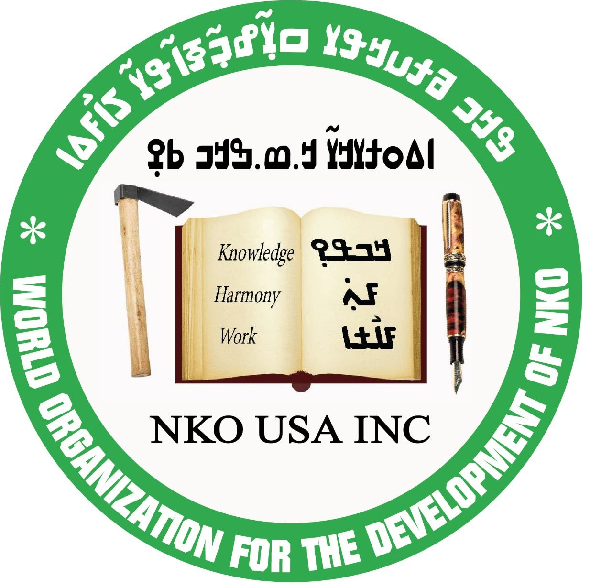
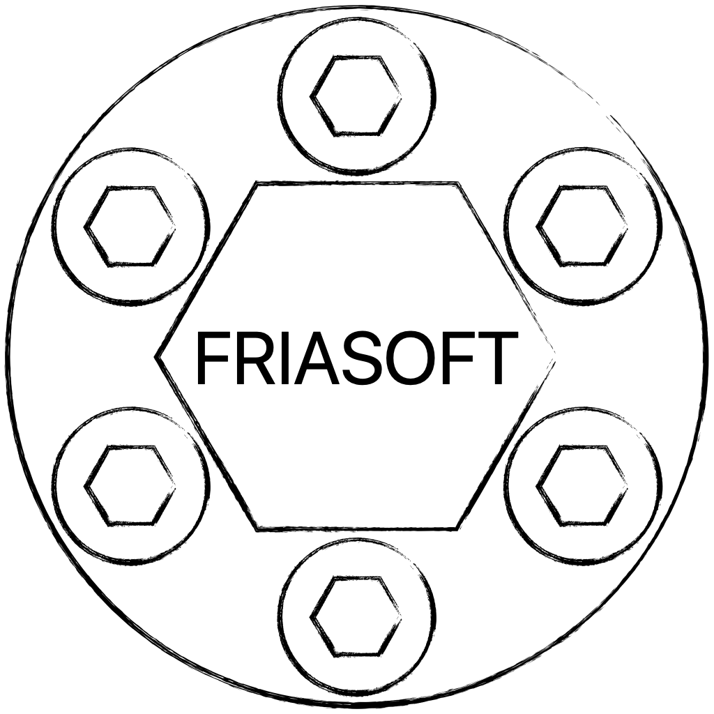

# Common Parallel Corpora
High quality community-curated extention of the following datasets:
- [multitext-nllb-seed](https://github.com/common-parallel-corpora/multitext-nllb-seed) (aligned version of [nllb-seed](https://github.com/facebookresearch/flores/tree/main/nllb_seed))
- [flores-200](https://github.com/facebookresearch/flores/blob/main/flores200/README.md)  
- [ntrex-128](https://github.com/MicrosoftTranslator/NTREX) (commin soon!)

## Description of Corpora
|dataset                                                |description|entries|languages|
|--|--|--|--|
|data/common-parallel-corpora/multitext-nllb-seed       |community extended multitext-nllb-seed|6193|[41](data/common-parallel-corpora/lang-list-multitext-nllb-seed.md)|
|data/common-parallel-corpora/multitext-nllb-seed-edits |translator edits multitext-nllb-seed|6193x4|1|
|--|--|--|--|
|data/common-parallel-corpora/flores-200-dev            |community extended flores-200-dev|997|[205](data/common-parallel-corpora/lang-list-flores-dev.md)|
|data/common-parallel-corpora/flores-200-dev-edits      |translator edits flores-200-dev|997x4|1|
|--|--|--|--|
|data/common-parallel-corpora/flores-200-devtest        |community extended flores-200-devtest|1012|[205](data/common-parallel-corpora/lang-list-flores-devtest.md)|
|data/common-parallel-corpora/flores-200-devtest-edits  |translator edits flores-200-devtest|1012x4|1|

## 2023-06-19: WMT 2023 N'ko NMT Task details
- train sets:
  - [nicolingua-0005-nqo-nmt-resources](https://github.com/mdoumbouya/nicolingua-0005-nqo-nmt-resources)
  - common-parallel-corpora/multitext-nllb-seed
- dev set:
  - common-parallel-corpora/flores-200-dev
- test set:
  - common-parallel-corpora/flores-200-devtest

## 2023-06-19: Data Release
Baba Mamadi Diané, Solo Farabado Cissé, and Djibrila Diané (all n'ko experts and native speakers) used a novel parallel text curation software to translate nllb-seed, flores-dev and flores-devtest to nqo_Nkoo ([n'ko language](https://en.wikipedia.org/wiki/N%27Ko_language) written in [n'ko script](https://en.wikipedia.org/wiki/N%27Ko_script)).

Each entry was translated (v1) once and verified/edited (v2, v3, v4) two or three times.

|lines|words|path|
|--:|--:|--|
|     6193 |   184138 | data/common-parallel-corpora/multitext-nllb-seed/nqo_Nkoo|
|     6193 |   170555 | data/common-parallel-corpora/multitext-nllb-seed-edits/nqo_Nkoo.v1|
|     6193 |   177703 | data/common-parallel-corpora/multitext-nllb-seed-edits/nqo_Nkoo.v2|
|     6193 |   182843 | data/common-parallel-corpora/multitext-nllb-seed-edits/nqo_Nkoo.v3|
|     6193 |   184138 | data/common-parallel-corpora/multitext-nllb-seed-edits/nqo_Nkoo.v4|
|--|--|--|
|      997 |    27361 | data/common-parallel-corpora/flores-200-dev/nqo_Nkoo.dev|
|      997 |    24455 | data/common-parallel-corpora/flores-200-dev-edits/nqo_Nkoo.dev.v1|
|      997 |    25656 | data/common-parallel-corpora/flores-200-dev-edits/nqo_Nkoo.dev.v2|
|      997 |    26541 | data/common-parallel-corpora/flores-200-dev-edits/nqo_Nkoo.dev.v3|
|      997 |    27361 | data/common-parallel-corpora/flores-200-dev-edits/nqo_Nkoo.dev.v4|
|--|--|--|
|     1012 |    29503 | data/common-parallel-corpora/flores-200-devtest/nqo_Nkoo.devtest|
|     1012 |    25924 | data/common-parallel-corpora/flores-200-devtest-edits/nqo_Nkoo.devtest.v1|
|     1012 |    27771 | data/common-parallel-corpora/flores-200-devtest-edits/nqo_Nkoo.devtest.v2|
|     1012 |    29521 | data/common-parallel-corpora/flores-200-devtest-edits/nqo_Nkoo.devtest.v3|
|     1012 |    29503 | data/common-parallel-corpora/flores-200-devtest-edits/nqo_Nkoo.devtest.v4|

## Contributors
- Moussa Koulako Bala Doumbouya (Stanford University, FriaSoft)
- Baba Mamadi Diané (N'ko USA Inc.)
- Solo Farabado Cissé (N'ko USA Inc.)
- Djibrila Diané (N'ko USA Inc.)
- Abdoulaye Sow (FriaSoft)
- Séré Moussa Doumbouya (FriaSoft)
- Daouda Bangoura (FriaSoft)
- Fodé Moriba Bayo (FriaSoft)
- Christopher D Manning (Stanford University)

## Ackowledgement
The authors would like to acknowledge the following sources of support:
- Unrestricted Research Gift from Meta Platforms, Inc. to NKO USA Inc.
- N'ko USA Inc.
- FriaSoft
- Stanford Graduate Fellowship (SGF, P. Michael Farmwald)
- Stanford NLP Group

<table>
  <tr>
    <td>
      N'ko ߒߞߏ USA
    </td>
    <td>
      FriaSoft
    </td>
    <td>
      Meta Platforms, Inc.
    </td>
    <td>
      Stanford University
    </td>
  </tr>
  <tr>
    <td>
      
    </td>
    <td>
      
    </td>
    <td>
      
    </td>
    <td>
      
    </td>
  </tr>
</table>

## License
 This work is licensed under a <a rel="license" href="http://creativecommons.org/licenses/by-sa/4.0/">Creative Commons Attribution-ShareAlike 4.0 International License</a>.