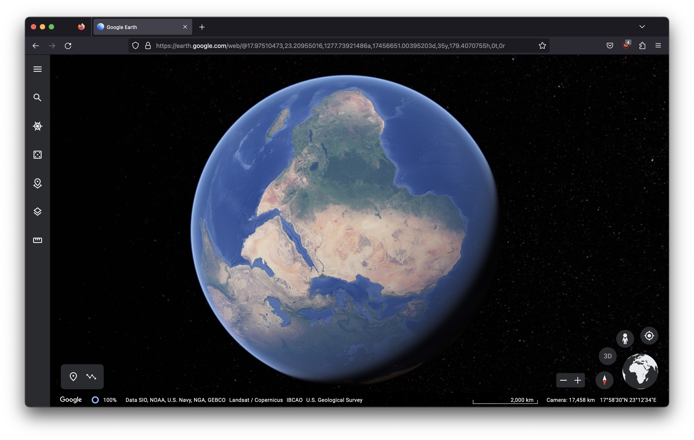
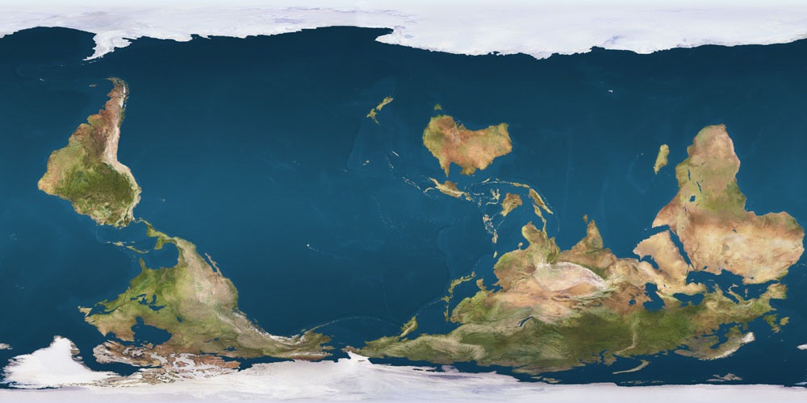

# Common Parallel Corpora 
<table>
  <tr>
    <td>
      
    </td>
    <td>
      
    </td>
  </tr>
</table>

A high-quality community-driven extension of  [multitext-nllb-seed](https://github.com/common-parallel-corpora/multitext-nllb-seed), [flores-200](https://github.com/facebookresearch/flores/blob/main/flores200/README.md), and [ntrex-128](https://github.com/MicrosoftTranslator/NTREX) to more languages.

|release|description|
|--|--|
| [common-parallel-corpora-2023-06-19.zip](https://github.com/common-parallel-corpora/common-parallel-corpora/archive/refs/tags/2023-06-19.zip)|(multitext-nllb-seed, flores-200) + nqo_Nkoo|
|in progress|ntrex-128 + nqo_Nkoo|
|planning|(multitext-nllb-seed, flores-200, ntrex-128) + ful_Adlm|

## Description of Corpora
|dataset                                                |description|entries|languages|
|--|--|--|--|
|cpc/multitext-nllb-seed       |extended multitext-nllb-seed|6193|[41](data/common-parallel-corpora/lang-list-multitext-nllb-seed.md)|
|cpc/multitext-nllb-seed-edits |translator edits multitext-nllb-seed|6193x4|1|
|--|--|--|--|
|cpc/flores-200-dev            |extended flores-200-dev|997|[205](data/common-parallel-corpora/lang-list-flores-200-dev.md)|
|cpc/flores-200-dev-edits      |translator edits flores-200-dev|997x4|1|
|--|--|--|--|
|cpc/flores-200-devtest        |extended flores-200-devtest|1012|[205](data/common-parallel-corpora/lang-list-flores-200-devtest.md)|
|cpc/flores-200-devtest-edits  |translator edits flores-200-devtest|1012x4|1|

## 2023-06-19: WMT 2023 N'ko NMT Task details
- datasets:
  - [common-parallel-corpora-2023-06-19.zip](https://github.com/common-parallel-corpora/common-parallel-corpora/archive/refs/tags/2023-06-19.zip)
  - [nicolingua-0005-nqo-nmt-resources-2023-06-19.zip](https://github.com/mdoumbouya/nicolingua-0005-nqo-nmt-resources/archive/refs/tags/2023-06-19.zip)

- train subsets (collectively cover 42 languages)
  - nicolingua-0005-nqo-nmt-resources ([3 languages](https://github.com/mdoumbouya/nicolingua-0005-nqo-nmt-resources))
  - common-parallel-corpora/multitext-nllb-seed ([41 languages](https://github.com/common-parallel-corpora/common-parallel-corpora/blob/master/data/common-parallel-corpora/lang-list-multitext-nllb-seed.md))
- dev subset:
  - common-parallel-corpora/flores-200-dev (205 languages)
- test subset:
  - common-parallel-corpora/flores-200-devtest (205 languages)
- focus directions:
  - (lang -> nqo_Nkoo) and (nqo_Nkoo -> lang) for [all other 204 languages in common-parallel-corpora/flores-200](https://github.com/common-parallel-corpora/common-parallel-corpora/blob/master/data/common-parallel-corpora/lang-list-flores-200-dev.md)

## 2023-06-19: Data Release
Baba Mamadi Diané, Solo Farabado Cissé, and Djibrila Diané (all n'ko experts and native speakers) used a novel parallel text curation software to translate nllb-seed, flores-dev and flores-devtest to nqo_Nkoo ([ߒߞߏ (n'ko) language](https://en.wikipedia.org/wiki/N%27Ko_language) written in [ߒߞߏ (n'ko) script](https://en.wikipedia.org/wiki/N%27Ko_script)).

Each entry was translated once (v1) and verified/edited two or three times (v2, v3, v4).

|lines|words|path|
|--:|--:|--|
|     6193 |   184138 | data/common-parallel-corpora/multitext-nllb-seed/nqo_Nkoo|
|     6193 |   170555 | data/common-parallel-corpora/multitext-nllb-seed-edits/nqo_Nkoo.v1|
|     6193 |   177703 | data/common-parallel-corpora/multitext-nllb-seed-edits/nqo_Nkoo.v2|
|     6193 |   182843 | data/common-parallel-corpora/multitext-nllb-seed-edits/nqo_Nkoo.v3|
|     6193 |   184138 | data/common-parallel-corpora/multitext-nllb-seed-edits/nqo_Nkoo.v4|
|--|--|--|
|      997 |    27361 | data/common-parallel-corpora/flores-200-dev/nqo_Nkoo.dev|
|      997 |    24455 | data/common-parallel-corpora/flores-200-dev-edits/nqo_Nkoo.dev.v1|
|      997 |    25656 | data/common-parallel-corpora/flores-200-dev-edits/nqo_Nkoo.dev.v2|
|      997 |    26541 | data/common-parallel-corpora/flores-200-dev-edits/nqo_Nkoo.dev.v3|
|      997 |    27361 | data/common-parallel-corpora/flores-200-dev-edits/nqo_Nkoo.dev.v4|
|--|--|--|
|     1012 |    29503 | data/common-parallel-corpora/flores-200-devtest/nqo_Nkoo.devtest|
|     1012 |    25924 | data/common-parallel-corpora/flores-200-devtest-edits/nqo_Nkoo.devtest.v1|
|     1012 |    27771 | data/common-parallel-corpora/flores-200-devtest-edits/nqo_Nkoo.devtest.v2|
|     1012 |    29521 | data/common-parallel-corpora/flores-200-devtest-edits/nqo_Nkoo.devtest.v3|
|     1012 |    29503 | data/common-parallel-corpora/flores-200-devtest-edits/nqo_Nkoo.devtest.v4|

## Contributors
- Moussa Koulako Bala Doumbouya (Stanford University, FriaSoft)
- Baba Mamadi Diané (N'ko USA Inc.)
- Solo Farabado Cissé (N'ko USA Inc.)
- Djibrila Diané (N'ko USA Inc.)
- Abdoulaye Sow (FriaSoft)
- Séré Moussa Doumbouya (FriaSoft)
- Daouda Bangoura (FriaSoft)
- Fodé Moriba Bayo (FriaSoft)
- Christopher D Manning (Stanford University)

## Ackowledgement
The authors would like to acknowledge the following sources of support:
- Unrestricted Research Gift from Meta Platforms, Inc. to NKO USA Inc.
- N'ko USA Inc.
- FriaSoft
- Stanford Graduate Fellowship (SGF, P. Michael Farmwald)
- Stanford NLP Group

<table style="text-align: center;">
  <tr>
    <td>
      
    </td>
    <td>
      
    </td>
    <td>
      
    </td>
    <td>
      
    </td>
  </tr>
  <tr>
    <td>
      N'ko ߒߞߏ USA
    </td>
    <td>
      FriaSoft
    </td>
    <td>
      Meta Platforms, Inc.
    </td>
    <td>
      Stanford University
    </td>
  </tr>
</table>

## License
 This work is licensed under a <a rel="license" href="http://creativecommons.org/licenses/by-sa/4.0/">Creative Commons Attribution-ShareAlike 4.0 International License</a>.